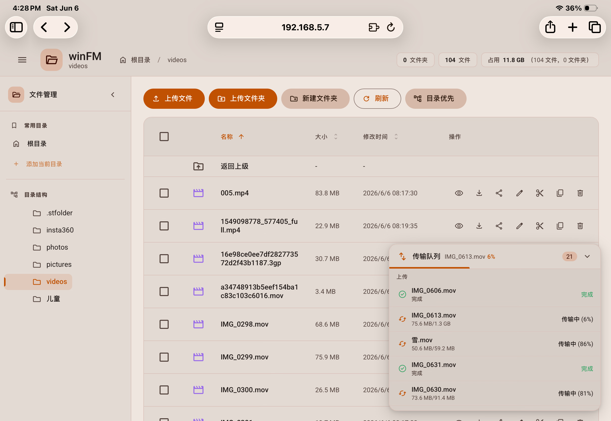

# winFM

基于 Docker 的轻量级 Web 文件管理器，单文件 Node.js 实现，无外部依赖。

📦 **Docker Hub 镜像**: [lagee/winfm](https://hub.docker.com/r/lagee/winfm)

🌐 **语言**: [English](README.en.md) | [中文](README.md)

## 🖼️ 示例图



## ✨ 功能特性

### 📂 文件管理
- 📤 文件上传（拖拽 + 多文件 + 进度显示）
- 📁 新建 / 删除 / 重命名文件和文件夹
- ✂️📋 移动 / 复制文件（剪贴板式操作）
- 📦 批量选择、删除、移动、复制
- ⬇️ 单文件 / 批量下载（逐文件直传，不打包）
- 🔗 分享直链功能（生成文件直链地址，方便分享）
- 📊 目录大小异步计算（实时显示目录占用空间、文件和文件夹数量）

### 👁️ 文件预览
- 🖼️ 图片预览（PNG、JPG、GIF、SVG、WebP）
- 🎬 视频播放（MP4、WebM）
- 🎵 音频播放（MP3、WAV）
- 📄 文本 / 代码文件预览（支持多种编程语言高亮）
- 📑 PDF、Office 文档（Word、Excel、PowerPoint）

### 🔀 排序与导航
- 按名称 / 大小 / 修改时间排序（升序 / 降序）
- 文件夹优先分组显示
- 🍞 面包屑导航
- 📂 侧栏布局（包含目录树和常用目录书签，支持折叠/展开）

### 🎨 界面设计
- 📱 响应式设计，完美支持移动端（操作收纳进「更多」菜单）
- 🎨 Material Design 3 橙色系主题（Material Web 组件 + Material Symbols 图标，自动适配深浅色，支持手动切换）
- 🔍 当前目录即时过滤搜索
- 🌐 组件与图标字体已内置本地化，离线 / 内网环境可用
- ⌨️ 快捷键支持（ESC 关闭弹窗，预览中左右方向键切换文件）

### 🔒 安全特性
- 路径遍历攻击防护
- 文件名安全验证
- 符号链接安全检查
- CSRF 跨站请求防护
- 管理员登录鉴权：表单登录 + 签名会话 Cookie，管理操作与目录浏览均需登录
- 未登录匿名查看：保留单文件直链查看，按 IP 限制可访问的不同文件数并在空闲后失活
- 登录失败按 IP 限流，防暴力破解

## 🚀 快速开始

### 使用 Docker Hub 镜像（最快）

```bash
# 直接拉取预构建镜像
docker pull lagee/winfm:latest

# 运行容器
docker run -d \
  --name file-manager \
  -p 8888:8888 \
  -v /your/local/path:/data \
  lagee/winfm:latest

# 访问
# http://localhost:8888
```

### 使用 Docker Compose（推荐）

创建 `docker-compose.yml` 文件：

```yaml
services:
  file-manager:
    image: lagee/winfm:latest
    container_name: file-manager
    restart: unless-stopped
    ports:
      - "8888:8888"
    volumes:
      - /your/local/path:/data
```

然后运行：

```bash
docker compose up -d
```

### 从源码构建

```bash
# 克隆仓库
git clone https://github.com/lageev/winFM.git
cd winFM

# 构建并启动
docker compose up -d

# 或者手动构建
docker build -t winfm .
docker run -d -p 8888:8888 -v /your/local/path:/data winfm
```

## ⚙️ 配置

### 挂载目录

编辑 `docker-compose.yml` 修改挂载目录：

```yaml
services:
  file-manager:
    image: lagee/winfm:latest
    container_name: file-manager
    restart: unless-stopped
    ports:
      - "8888:8888"
    volumes:
      - /your/local/path:/data   # 将本地目录映射到容器内 /data
```

### 端口配置

端口默认 `8888`，可在 `docker-compose.yml` 中修改：

```yaml
ports:
  - "8080:8888"  # 改为 8080 端口
```

### 环境变量配置

使用 `.env` 文件配置本地路径，方便不同环境使用不同配置：

```bash
# 复制模板并修改
cp .env.example .env
```

编辑 `.env` 文件：

```env
# 数据目录的本地路径
DATA_DIR=/your/local/path
```

`docker-compose.yml` 中使用 `${DATA_DIR}` 引用：

```yaml
volumes:
  - ${DATA_DIR}:/data
```

> **注意**: `.env` 文件已被 `.gitignore` 忽略，不会同步到远程仓库。

### 访问认证（管理员登录）

设置管理员密码后开启登录鉴权，管理操作与目录浏览均需登录：

```yaml
environment:
  - FM_USER=admin              # 管理员用户名，默认 admin
  - FM_PASS=yourpassword       # 管理员密码，留空则不启用鉴权
  - FM_SECRET=random-long-str  # 会话签名密钥，建议设置以持久化登录态
  - FM_SESSION_HOURS=168       # 可选，会话有效期（小时），默认 7 天
```

- 仅单一管理员账户；访问目录或管理页面会跳转到登录页 `/__fm/login`，右上角可退出登录。
- 未设置 `FM_SECRET` 时密钥随机生成，服务重启后需重新登录。
- 兼容旧格式：`FM_AUTH=admin:yourpassword`（等价于 `FM_USER` + `FM_PASS`）。

### 未登录匿名查看

开启鉴权后，未登录用户仍可通过直链查看单个文件（用于对外分享），但受配额限制；目录浏览与所有写操作仍需登录：

```yaml
environment:
  - FM_ANON=1            # 1 开启（默认），0 关闭后所有访问都需登录
  - FM_ANON_LIMIT=20     # 时效内每个 IP 可查看的不同文件数上限
  - FM_ANON_IDLE_MIN=30  # 空闲多少分钟后额度失活并重置
```

- 同一文件重复访问、断点续传不重复计数；不同文件累计达到上限后返回 `429`。
- 空闲超过 `FM_ANON_IDLE_MIN` 后该 IP 的额度失活并重新计算。

### 分享直链（自定义次数与有效期）

开启鉴权后，登录管理员可在文件的"分享"对话框为单个文件生成签名分享链接，并自定义：

- 查看次数：填 0 表示不限，达到上限后链接失效。
- 有效期（小时）：填 0 表示永久，超时后链接失效。

链接形如 `/__fm/s?t=<签名token>`，凭链接无需登录即可查看该文件；token 经 HMAC 签名不可篡改，有效期由签名保证、服务重启后仍有效（查看次数计数为内存态，重启会重置）。

### 本地配置（不同步到远程仓库）

如果你需要保留本地特定的配置（如挂载路径、端口等），可以创建本地配置文件：

```bash
# 复制配置文件为本地版本
cp docker-compose.yml docker-compose.local.yml
cp watch-deploy.ps1 watch-deploy.local.ps1
```

然后编辑 `docker-compose.local.yml` 修改为你本地的路径：

```yaml
services:
  file-manager:
    image: lagee/winfm:latest
    container_name: file-manager
    restart: unless-stopped
    ports:
      - "8888:8888"
    volumes:
      - D:/your/local/path:/data  # 修改为你本地的路径
```

使用本地配置运行：

```bash
# 使用本地配置文件启动
docker compose -f docker-compose.local.yml up -d

# 使用本地监控脚本
.\watch-deploy.local.ps1
```

> **注意**: `*.local.yml` 和 `*.local.ps1` 文件已被 `.gitignore` 忽略，不会同步到远程仓库。

### ⚠️ 目录权限问题

容器以非 root 用户 `nodejs`(uid=1001) 运行。如果挂载的目录中存在由其他工具（如 Syncthing、Samba 等）创建的子目录，这些目录可能属于 root 且权限为 `755`，导致无法上传文件。

**症状**: 根目录可上传，但某些子目录上传失败。

**解决方法**: 在宿主机上修复权限：

```bash
# Linux/Mac
chmod -R 777 /your/local/path

# Windows (在容器内执行)
docker exec -u root file-manager chmod -R 777 /data/
```

**或者**，在 `docker-compose.yml` 中以 root 用户运行（简单但安全性稍低）：

```yaml
services:
  file-manager:
    image: lagee/winfm:latest
    container_name: file-manager
    restart: unless-stopped
    user: "0:0"  # 以 root 运行
    ports:
      - "8888:8888"
    volumes:
      - ${DATA_DIR}:/data
```

## 🛠️ 技术栈

- **运行时**: Node.js 20 (Alpine)
- **依赖**: busboy（流式上传解析）
- **UI 组件**: Material Web（Material Design 3，已打包内置，无 CDN 依赖）
- **图标**: Material Symbols（内置字体子集）
- **样式**: Material Design 3 设计令牌（原生 CSS，运行时无构建步骤）
- **传输**: HTML gzip 压缩、静态资源强缓存、文件 ETag/304、Range 断点续传

## 📁 支持的文件类型

| 类型 | 扩展名 |
|------|--------|
| 图片 | PNG、JPG、JPEG、GIF、SVG、WebP、ICO |
| 视频 | MP4、WebM |
| 音频 | MP3、WAV |
| 文档 | PDF、DOC、DOCX、XLS、XLSX、PPT、PPTX、CSV |
| 代码 | HTML、CSS、JS、JSON、TypeScript、JSX、TSX、Vue、Python、Java、C/C++、Go、Rust 等 |
| 其他 | TXT、MD、YAML、YML、XML、LOG、Shell 脚本 |

## 📝 使用说明

1. **上传文件**: 点击上传按钮或直接拖拽文件到页面
2. **新建文件夹**: 点击文件夹图标按钮
3. **批量操作**: 勾选多个文件后使用底部操作栏
4. **排序**: 点击表头的名称、大小、时间进行排序
5. **预览**: 点击文件名旁的眼睛图标
6. **下载**: 点击下载图标，或批量选择后逐个下载（文件夹请进入后再选择文件）
7. **分享直链**: 点击文件操作列的分享图标，复制文件直链地址
8. **侧栏导航**: 点击左上角菜单图标展开侧栏，查看目录树和常用目录书签
9. **目录大小**: 页面顶部统计栏异步显示当前目录占用空间

## 📄 许可证

MIT License
